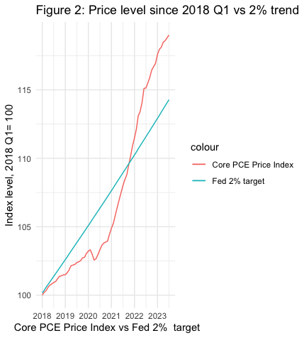

# ** Inflation in pre and post Covid in US 2019-2023 **
### Source of Data: Fred
### The code shown illustrate the trend of inflation in both pre covid starting from jan-2019 to July-2023 versus the Fed's 2% inflation targetting each year. The figure shows the quaterly percentage change in the Monthyl core Personal Consumption Expenditure (PCE) price index reltaive to the Fed's 2% inflation target. In other word, it is simply inflation rate against Fed 2% static benchmark.
### The graph shows that starting 2021, the inflatio boomed from its level lower than 2% to more than 7 percent in the mid 2022 which followed by a decline to 3.5% in the mid 2023. 
#### Note: Data taken for both graph in this study is indexed for 100 in Jan 2018. 

### Moreover; we want to show the price level or the Core PCE price index agains what the price level would have been had inflation risen every quarter at an annualixed rate of 2%  in absence of covid-19 for the period of 2019-2013. More clearly, we turn to show the realized value of the inflation given the counterfactual covid-19. 
 
## The graph shwos that the start of covid-19 in the Jan 2020 causesd a sharp fall in the price level widening the gap between realized infaltion and actual PCE core inflation continues till mid-2020, starting 2021, thenpricelevel increased sharply passing the realized price level in end 2021. As the graph shows , the price level reacehd its max level in the mid 2023, far above the realized price level by Fed. 

